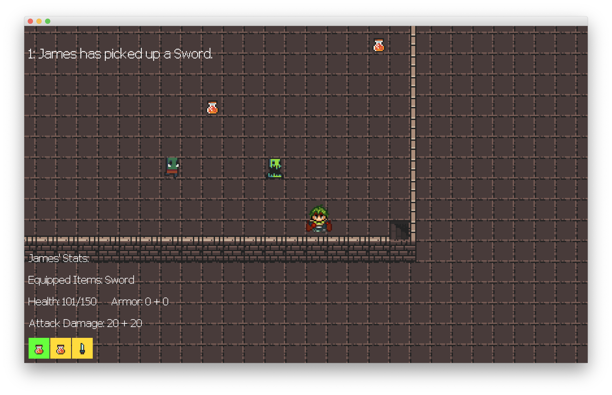
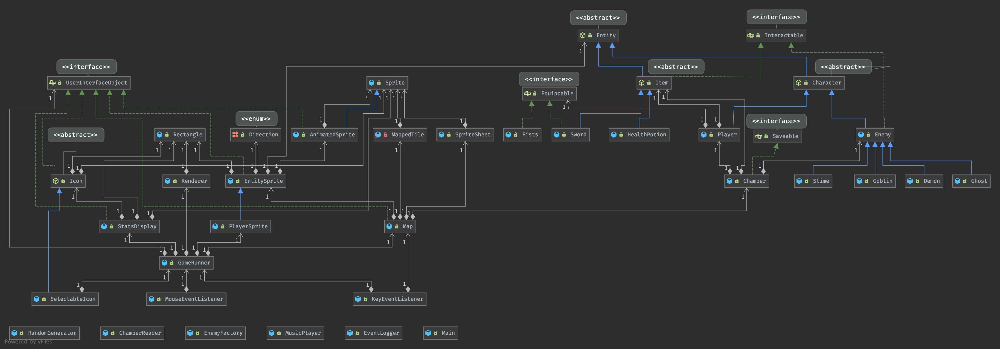

# Eterna (Rogue in Java)

## About the Project

This project is a rogue-like dungeon crawling game that is highly inspired by the
[original rogue](<https://en.wikipedia.org/wiki/Rogue_(video_game)>), which is considered
by many to be the start of the genre. In the game, the player tries to reach the end of
the procedurally generated dungeon while fighting enemies and collecting treasure.

On the way, the player will:

- get to choose a class with different stats
- collect gear
- slay unique enemies
- try to avoid dying, as death is permanent!

## Use Case

The main use case of this project is as a fun way to take a break from school or work
in a simple yet engrossing rogue-like game. Thus, the game is meant to reach a large audience,
from teenagers to adults who would like to explore a game similar to one of the classic
games that inspired a whole genre!

## Why I Wanted to Build It

There are two main reasons why I wanted to create this project. Firstly, ever since I was
a kid, I loved playing video games and rogue-like was one of my favourite genres along
with role-playing games (RPGs). Thus, creating this game seemed like a natural fit where
I could get to know more about the internals of the game and how it works. Secondly,
I thought that making a game would be both fun to create, and could quite naturally fit
with object-oriented principles that are being taught in class. In this way, I could
practically apply in-class lessons while continuing to stay passionate about what I am
learning.

## User Stories

**Phase 1:**

- As a user, I want to be able to add an item to my inventory and use it later
- As a user, I want to be able to move around and see where I am
- As a user, I want to be able to see my stats so I can make my next move accordingly
- As a user, I want to be able to progress to the next stage with enemies randomly generated

**Phase 2:**

- As a user, I want to be able to save the state of the game to a file
- As a user, I want to be able to load the state of a game in progress from a file 
and continue from where I was

## Instructions for Grader

- To see the player's inventory, you have to collect some items first by moving into them 
with the appropriate directional key. Then, in the bottom left of your screen, you should
see sprites that represent the items in your inventory. If you have multiple items you can
change between them by clicking – the selected item will have a green background, while 
the others will have a yellow background.
- To use the item you have selected, you just need to press the <code>E</code> key, and it will 
either consume or equip that item, as well as automatically removing it from your inventory!
- My audio component is background music which is triggered just by starting the game.
- To save the state of the game, hit <code>O</code> for options, then type <code>save</code>
into the prompt box, and the game should be saved while still allowing you to continue.
- To reload the state of a previously saved game, hit <code>O</code> for options, then type 
<code>load</code> into the prompt box, then you should see a list of all saved files and can
select one by inputting the given index into the prompt box. After this, the game should be
loaded in!

## Phase 4: Task 2

I chose to incorporate a type hierarchy in my project since it is very applicable to modelling
the game and helping to abstract away common features. Almost all of the model and part of the 
user interface is involved in the hierarchy but to point out the key parts of it, in the model
there is an Entity abstract class for anything with a position, Character and Item classes that
extend Entity with more specific behaviour, and interfaces such as Equippable for items that can 
be equipped and Interactable for anything the player can interact with. For a more concrete example,
since item implements Interactable, it defines that they are picked up when interacted with (which 
the subclasses get for free) but they must define how they use used in their own way. In this case
the health potion is used by healing the player, while the sword is used by being equipped to the
player and granting more damage.

## Phase 4: Task 3 

In the GameRunner class I noticed that there was both a poor cohesion and a bit too much coupling
since it was becoming a class where I could just put something if I wasn't sure where it went. I 
decided to firstly extract anything to do with playing music into its own singleton class called 
MusicPlayer to help improve the cohesion. Next, in order to reduce coupling, I decided to make 
ChamberReader a singleton class so that there wouldn't have to be a field for it in GameRunner.
It also makes sense that ChamberReader is a singleton since it is more of a utility class. Lastly,
I further reduced coupling by removing the references to the chamber in GameRunner since they 
don't really belong there and make more sense belonging to the Map class, since that is where 
the chamber is dealt mainly with. 

### UML Class Diagram

## Credit

The basic game engine (renderer and sprite classes) are influenced by 
[Marcus Dubreuil's tutorial on Java game programming](<https://www.youtube.com/watch?v=lDzKX3djE-M>).